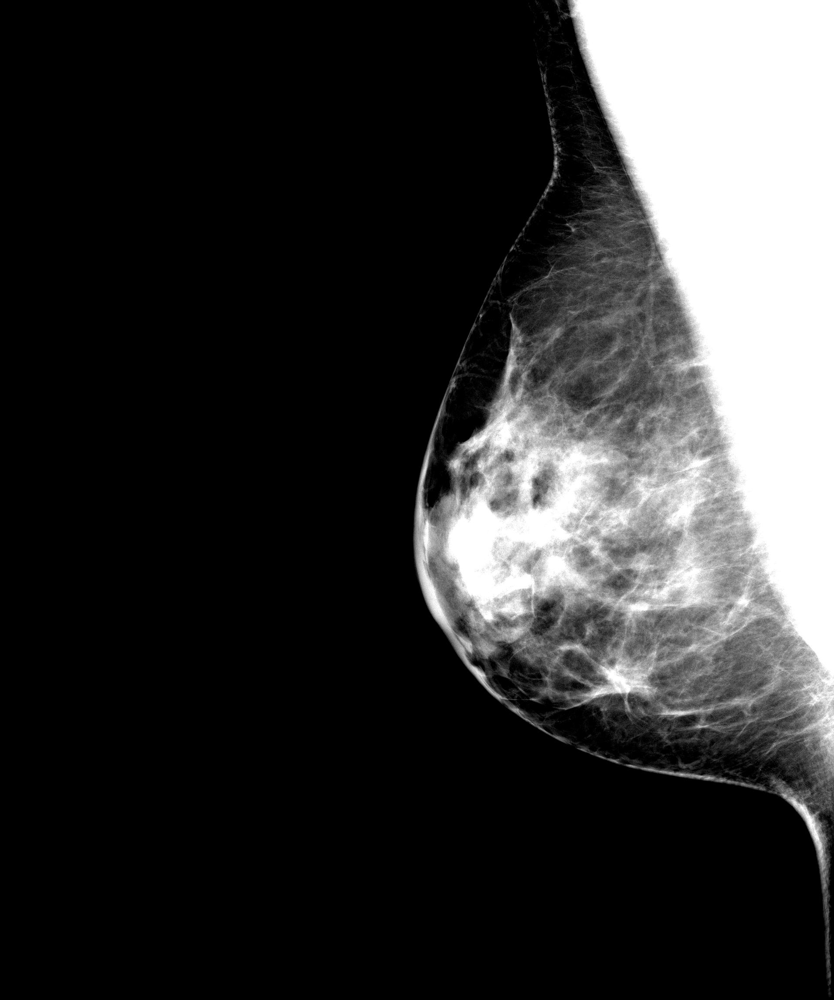
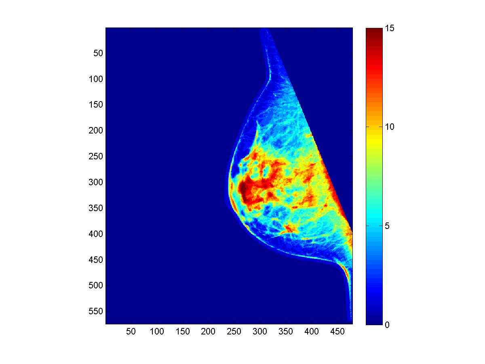
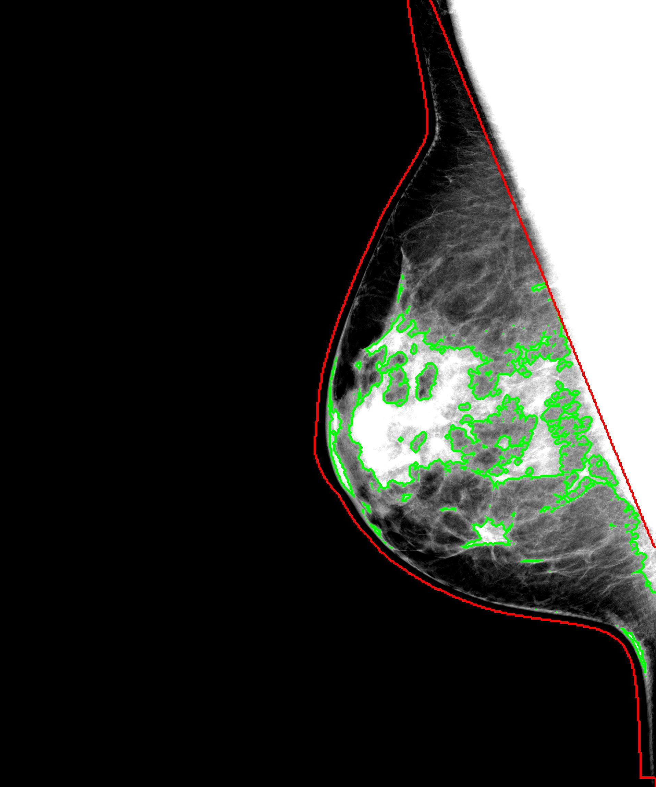

.. raw:: html

   <!--

   ============================================================================

      DO NOT EDIT THIS FILE! It was generated using Sphinx from:

      Origin:   $URL$
      Revision: $Rev$

   ============================================================================

   -->

.. title:: About LIBRA

.. meta::
   :description: Brief overview of the LIBRA.
   :keywords: LIBRA.
 

.. raw:: latex

    \pagebreak

===================
About the Algorithm
===================

|Orig| |Clusters| |Seg|

   
The amount of fibroglandular tissue content in the breast as estimated mammographically, commonly referred to as breast percent density (PD%), is one of the most significant risk factors for developing breast cancer. Approaches to quantify breast density commonly focus on either semiautomated methods or visual assessment, both of which are highly subjective. This software package was developed to be a fully-automated density estimation method that works on both raw (i.e., "FOR PROCESSING") and vendor postprocessed (i.e., "FOR PRESENTATION") digital mammography images,and has thus far been validated to work on GE Healthcare and Hologic digital mammography systems [*]_.

Briefly, the software first applies an edge-detection algorithm to delineate the boundary of the breast and the boundary of the pectoral muscle. Following the segmentation of the breast, an adaptive multi-class fuzzy c-means algorithm is applied to identify and partition the mammographic breast tissue area, into multiple regions (i.e., clusters) of similar intensity. These clusters are then aggregated by a support-vector machine classifier to a final dense tissue area, segmentation. The ratio of the segmented absolute dense area to the total breast area is then used to obtain a measure of breast percent density (PD%). 

The software generates both quantitative estimates of breast area, dense area and PD% that are stored in a comma separated text file (.csv, openable by Excel) as well as a .JPG image of the breast and density segmentations overlaid on a window-levelled version of the mammogram amenable for publication to a user-defined directory, in addition to several optional files, as described in the Manual Section.

.. [*] *DISCLAIMER: Density estimation on mammograms from other vendors has not been validated, therefore the performance and the quality of segmentation is not guaranteed. However the breast segmentation algorithm within LIBRA generally works well across all vendors and thus may be of general use in a research context.*

